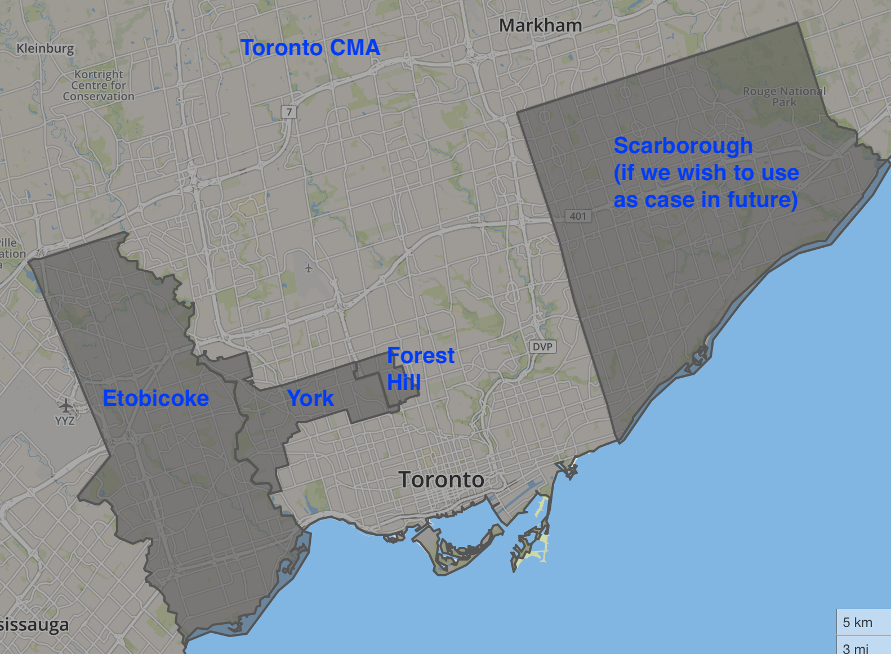

# toronto-cma-income-areas
Toronto CMA income map with case study areas

## Jack's notes for Ilya

Tip: This is my new favorite tool for grabbing GeoJSON boundaries from Open Street Map data: http://hanshack.com/geotools/gimmegeodata/

NOTE: Jack used http://Mapshaper.org to reproject all shapefiles to WGS84 and edit features from most sources below.

Goal: create a Leaflet interactive map of metro Toronto with these layers, preferably by Friday Feb 28th or sooner, so that Jack may make a screenshot to include in a grant proposal that is due a few days later.

1) Basemap layer = CartoDB positron with labels

2) Toronto CMA (Census Metropolitan Area, aka Greater Toronto Area GTA) will appear as the exterior boundary (see `geodata` subfolder: toronto-cma-boundary-2016-dli.geojson), but do not list in legend, no toggle

3) Case study areas (toggle each on/off in legend, display transparent polygons, with thick colored boundary, choose different color for each and display color next to name in legend, similar to https://jackdougherty.github.io/bikemapcode/newbritain.html)
  - See each boundary file in `geodata` subfolder
  - Etobicoke (etobicoke-boundary-osm.geojson)
  - Forest Hill (forest-hill-boundary-1961-dli.geojson) *borders not perfectly aligned, but use for now*
  - York (york-boundary-osm.geojson)
  - Scarborough (scarborough-boundary-osm.geojson) *in case Jason and I wish to use it in future*

4) Individual personal income as percentage of Toronto CMA Average, by census tract, for either 2016 or 2011. List in legend, toggle on/off to display thematic choropleth polygon map with divergent colors similar to what 'The Local' did with 2016 data in https://thelocal.to/mapping-our-divisions, but 2D, not 3D)

About 2016 vs 2011 census tract data for Toronto CMA:

- We would prefer 2016 tract data if you can successfully download and join it, since that's what The Local did, and here's my suggestions for how to do this, with some of the work done for you:
- See `geodata` folder for the relevant census tract boundaries: toronto-cma-tracts-2016-statcan.geojson
- Each census tract has a unique CTUID
- See The Local methodology page to follow their sources: http://www.mapto.ca/maps/thelocal
- Following their StatCan link, I found 2016 census tract data for income, but only for all of Canada, and it's a 164GB zipped CSV file, too big for me to easily open and inspect: https://www12.statcan.gc.ca/census-recensement/2016/dp-pd/prof/details/page_Download-Telecharger.cfm?Lang=E&Tab=1&Geo1=CSD&Code1=3520005&Geo2=PR&Code2=35&Data=Count&SearchText=Toronto&SearchType=Begins&SearchPR=01&B1=All&TABID=1
- Or it's possible that one can download 2016 income data by census tracts here: https://www150.statcan.gc.ca/n1/en/type/data?geoname=S0507

- But if you cannot make this work easily for 2016, then Jason provided income data from the 2011 National Household Survey by census tracts:
- see `census` subfolder (2011-NHS-census-tract-data.csv)
- see COL 18: Income of individuals in 2010
- See `geodata` folder for census tract boundaries (toronto-cma-tracts-2011-statcan.geojson)
- See Jason's notes below about 2011 data

### Jason's notes (and Jack has already done several steps for Ilya above)

DLI 2011 Census… Should include all geospatial data for Toronto CMA (census metropolitan area). Might include all CMA data for the entire country! If it does, then Jack/Ilya will have to select the shape files corresponding to the Toronto CMA and make a Toronto base map. Tract level boundary files will be here, corresponding to the data below.

Census.csv… Raw, data for Toronto CMA, income variables only. Extracted from census analyzer. Legend at top indicates tract names for Toronto that will correspond to shape files in above.
However, note that the income data is from the 2011 National Household Survey, not the 2011 Census of Canada (which did not collect household income data). Here’s a good explanation of the differences between the National Household Survey and the Census of Canada: https://guides.library.ubc.ca/gpcanadacensus/censusNHS

I was unable to find shape files for Forest Hill, York, and Etobicoke. However, we can construct these by the back door, using different corresponding census tract shape files that are available. Here’s what I recommend:

To make shape files for Forest Hill:
-	The last Canadian decennial census year Forest Hill existed as a separate municipality was 1961.
-	(the Village of) Forest Hill corresponded to tracts 150, 151, 152, and 153 in the 1961 census (see Forest Hill census tracts 1961.png.)
-	Extract the shape files from DLI 1961 Census… for tracts 150, 151, 152, and 153 and use these to mark a Forest Hill layer on the Toronto base map

To make shape files for Etobicoke:
-	The last change to Etobicoke’s boundaries (before it was dissolved completely) was in 1967, reflected in the 1971 decennial census maps.
-	In the 1971 maps, Etobicoke corresponded to tracts 200-250 (see gtf71cbk.pdf, page 27)
-	Extract the shape files from DL 1971 Census… for tracts 200-250.

Ditto for (The Township) of York (aka The Borough of York) (nb not York County; not York Region, not the Borough or Township of North York; not the Borough or Township of East York. Not York University. Just “York (Township/later called Borough of York”. Toronto has too many Yorks, by far)
-	In 1971 maps York corresponded to tracts 150-176 (see gtf71cbk.pdf, page 26)
-	Extract the shape files from DL 1971 Census… for tracts 150-176
